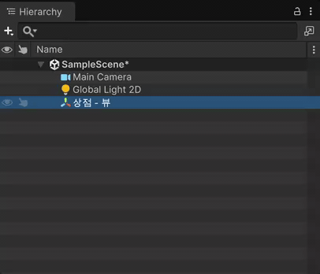

# Quick Translate

Unity 에디터에서 **GameObject / 에셋 이름을 한국어 ↔ 영어로 바로 번역**해 이름을 바꾸는 도구입니다.
Hierarchy 나 Project 창에서 선택하고 단축키를 누르면, 선택한 행 바로 아래에 번역 후보가 뜨고 Enter 로 적용합니다.

<table>
  <tr>
    <td width="43%" valign="middle"></td>
    <td width="57%" valign="middle"></td>
  </tr>
</table>

### 특징
- <kbd>Cmd</kbd> + <kbd>Shift</kbd> + <kbd>X</kbd> (Windows: <kbd>Ctrl</kbd> + <kbd>Shift</kbd> + <kbd>X</kbd>) 단축키를 눌러 한글이 있으면 한→영, 영문만 있으면 영→한으로 자동 판별
- 여러 개 선택 시 차례로 처리, `Shift+Enter` 로 나머지 일괄 적용
- GameObject 이름 변경은 Undo 지원 (에셋 이름 변경은 Unity 특성상 Undo 불가)
- 번역 엔진 선택: Google(무료·실험적), Google Cloud Translation, DeepL, Papago, Claude, ChatGPT, Gemini

## 유니티 지원 버전

- Unity 6.0 (6000.0) LTS 
- Unity 6.3 (6000.3) LTS
- Unity 6.5 (6000.5)
- Unity 6.7 Beta (6000.7) Or Higher

## 설치 (Git UPM)

**Window > Package Manager > + > Install package from git URL…** 에 입력:

```
https://github.com/NK-Studio/quick-translate.git
```

## 사용법

1. **Hierarchy · Project · Inspector** 어디서든 이름을 바꿀 GameObject / 에셋을 선택합니다.
2. <kbd>Cmd</kbd> + <kbd>Shift</kbd> + <kbd>X</kbd> (Windows: <kbd>Ctrl</kbd> + <kbd>Shift</kbd> + <kbd>X</kbd>) 를 누릅니다.
3. 선택한 이름 바로 아래에 뜬 팝업에서 후보를 고르고 <kbd>Enter</kbd> 로 적용합니다.

<table>
  <tr>
    <th width="33%">Hierarchy</th>
    <th width="33%">Project</th>
    <th width="33%">Inspector</th>
  </tr>
  <tr>
    <td valign="top"></td>
    <td valign="top"></td>
    <td valign="top"></td>
  </tr>
  <tr>
    <td valign="top">선택한 행 바로 아래에 표시.<br/>GameObject 이름 변경은 Undo 지원.</td>
    <td valign="top">에셋·폴더 이름. <code>에셋</code> 칩으로 구분.<br/>확장자는 유지, Undo 는 불가.</td>
    <td valign="top">Inspector 에 포커스가 있으면<br/>이름 칸 바로 아래에 표시.</td>
  </tr>
</table>

### 팝업 조작

| 키 | 동작 |
|---|---|
| <kbd>↑</kbd> <kbd>↓</kbd> | 후보 이동 |
| <kbd>Enter</kbd> | 적용 |
| <kbd>Tab</kbd> | 선택한 후보를 직접 수정 |
| <kbd>Shift</kbd> + <kbd>Enter</kbd> | 현재 적용 + 남은 항목 모두 1순위로 적용 (여러 개 선택 시) |
| <kbd>Esc</kbd> | 닫기 |

> [!TIP]
> 단축키는 `Edit > Shortcuts` 에서 `Quick Translate` 로 검색해 바꿀 수 있습니다.

## 설정

### Preferences › Quick Translate — 개인 설정

번역 엔진, 최대 후보 수, 첫 글자 대/소문자 우선, 문맥(DeepL·AI), AI 모델을 고릅니다. 이 PC 에만 저장됩니다.


### Project Settings › Quick Translate — 팀 용어집

프로젝트에서 쓰는 용어를 등록해 두면 번역 결과보다 먼저 반영됩니다. (예: `상점` ↔ `Shop`)

<table>
  <tr>
    <th width="50%">① 용어집에 <code>상점</code> ↔ <code>Shop</code> 등록</th>
    <th width="50%">② <code>상점 - 뷰</code> 번역 후보에 <code>Shop - View</code> 추가</th>
  </tr>
  <tr>
    <td valign="top"></td>
    <td valign="top"></td>
  </tr>
</table>

- **이름 전체가 일치**하면 그 용어가, **일부 단어만 일치**하면 그 용어를 넣어 조합한 이름이 맨 위(BEST) 후보가 됩니다. (`상점 - 뷰` → `Shop - View`)
- **한→영 / 영→한 양방향**으로 쓰입니다. 공백·밑줄 차이는 무시하고, 영어 쪽은 대소문자도 무시합니다 (`Health Bar` = `health_bar`).
- AI 엔진(Claude·ChatGPT·Gemini)에는 용어집이 지시문으로 전달되어 번역 전체에 적용됩니다.
- `ProjectSettings/QuickTranslateGlossary.asset` 에 저장되므로 **VCS 로 팀과 공유**됩니다.
- `+` / `−` 로 추가·삭제하고, 행을 끌어 순서를 바꿉니다 (같은 영어가 여러 번이면 위쪽 우선).

### API 키 (.env)

API 키는 **프로젝트 루트(Assets 폴더 옆)의 `.env`** 에서 읽습니다. Assets 밖이라 빌드에 포함되지 않습니다.
**`.env` 는 VCS 에 올리지 마세요** (`.gitignore` 에 `.env` 추가).


```
DEEPL_API_KEY=...
GOOGLE_TRANSLATE_API_KEY=...
PAPAGO_CLIENT_ID=...
PAPAGO_CLIENT_SECRET=...
ANTHROPIC_API_KEY=...
OPENAI_API_KEY=...
GEMINI_API_KEY=...
```

사용하는 엔진의 키만 넣으면 됩니다. 설정 화면의 `.env 만들기` / `빠진 키 항목 추가` 버튼으로 틀을 만들 수 있습니다.

| 엔진 | 키 | 비고 |
|---|---|---|
| Google (무료·실험적) | 필요 없음 | 비공식 엔드포인트. 예고 없이 막히거나 IP 단위로 차단될 수 있음 |
| Google (공식 API) | `GOOGLE_TRANSLATE_API_KEY` | Cloud Translation API (Basic, v2) |
| DeepL | `DEEPL_API_KEY` | `:fx` 로 끝나면 Free API. 문맥(context) 지원 |
| Papago | `PAPAGO_CLIENT_ID`, `PAPAGO_CLIENT_SECRET` | 네이버 클라우드 플랫폼 Papago Translation |
| Claude / ChatGPT / Gemini | `ANTHROPIC_API_KEY` / `OPENAI_API_KEY` / `GEMINI_API_KEY` | AI 가 후보를 직접 생성, 용어집·문맥을 지시문으로 전달 |

번역할 이름(과 AI 엔진의 경우 용어집·문맥)은 선택한 번역 서비스로 전송됩니다.

## 라이선스

[MIT](LICENSE.md)
